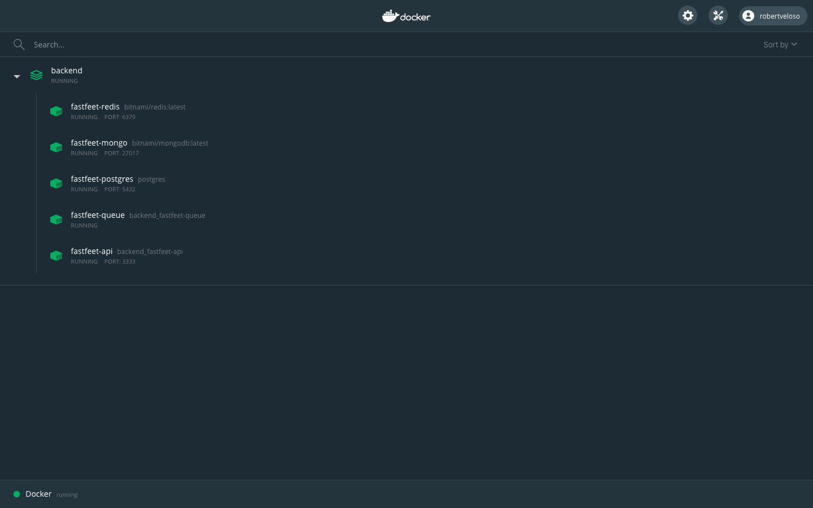
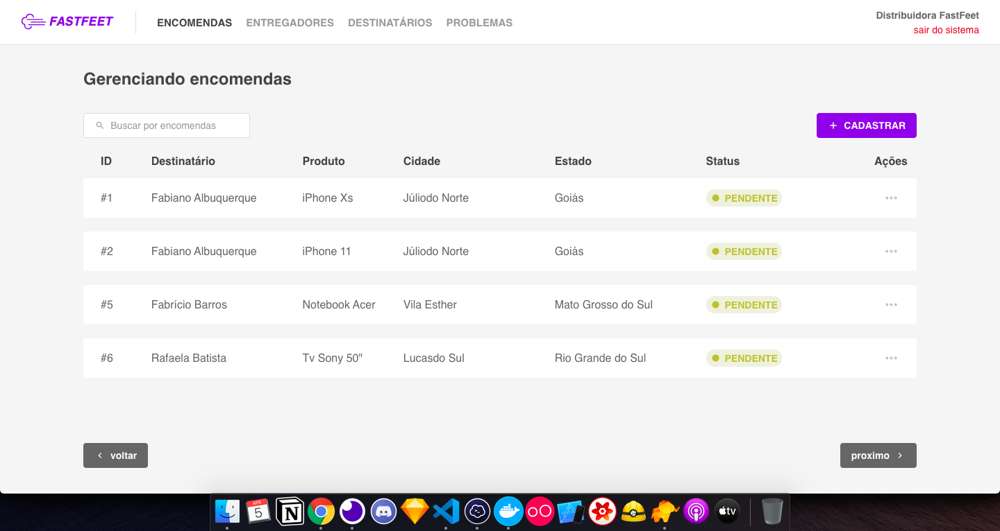
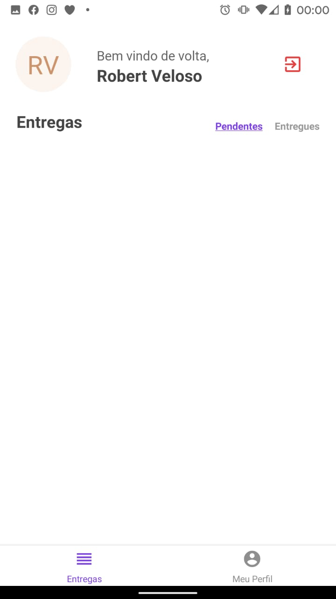

<h1 align="center">
  
</h1>

My Bootcamp GoStack 10.0 Project

 <a href="#rocket-techs">Techs</a>&nbsp;&nbsp;&nbsp;|&nbsp;&nbsp;&nbsp;
 <a href="#computer-build-in-your-machine">Build in your machine</a>&nbsp;&nbsp;&nbsp;|&nbsp;&nbsp;&nbsp;
<a href="#memo-license">License</a>

  

<strong>Links dos desafios:</strong>

- [Etapa 1](https://github.com/Rocketseat/bootcamp-gostack-desafio-02)
- [Etapa 2](https://github.com/Rocketseat/bootcamp-gostack-desafio-03)
- [Etapa 3](https://github.com/Rocketseat/bootcamp-gostack-desafio-09)
- [Etapa 4](https://github.com/Rocketseat/bootcamp-gostack-desafio-10)

## :rocket: Techs

This project was built using:

- [Node.js](https://nodejs.org/en/)
- [React](https://reactjs.org/)
- [Docker](https://www.docker.com/)
- [Docker Compose](https://docs.docker.com/compose/)
- [PostgreSQL](https://www.postgresql.org/)
- [MongoDB](https://www.mongodb.com/)
- [Express](https://github.com/expressjs/express)
- [Redis](https://redis.io/)
- [Bee-Queue](https://github.com/bee-queue/bee-queue)

## :computer: Build in your machine

Clone this repo, and install docker, docker-compose.

<h1 align="center">
  
</h1>

### Root

- Run `yarn` to install husky dependencies for git powers;

### Backend

- cd to the backend folder from the root of the project `cd backend`;
- Run `yarn` to install the dependencies;
- Copy the .env.example and use your environment variables;
- Run `yarn start` to start the docker project;
- Run `yarn resetDatabase` to run the migrations and populate the database;
- Either import the insomnia file, run the frontend, or the mobile app;

### Frontend

- cd to the frontend folder from the root of the project `cd - && cd frontend`;
- Run `yarn` to install the dependencies;
- Run `yarn start` to start the react project;

<h1 align="center">
  
</h1>

### Mobile

- cd to the frontend folder from the root of the project `cd - && cd mobile`;
- Run `yarn` to install the dependencies;
- cd to ios and run `pod install && cd -`
- Run `yarn ios` to start ios app or `yarn android` to start the android app;

<h1 align="center">
  
</h1>

## :memo: License

This project is under MIT license. check this file [LICENSE](LICENSE.md) for more info.

---

Build with ♥ by [Robert Veloso](https://www.linkedin.com/in/robertveloso/)
